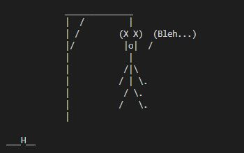
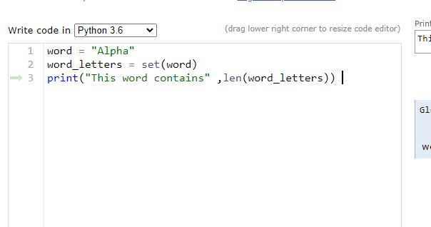
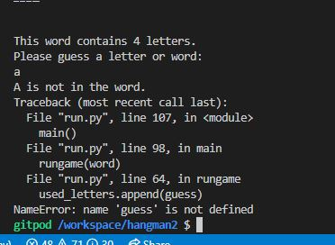
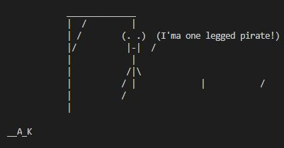
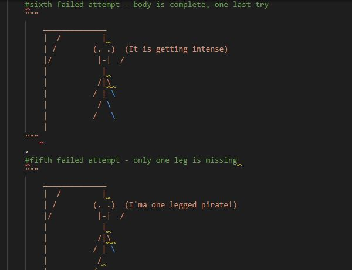
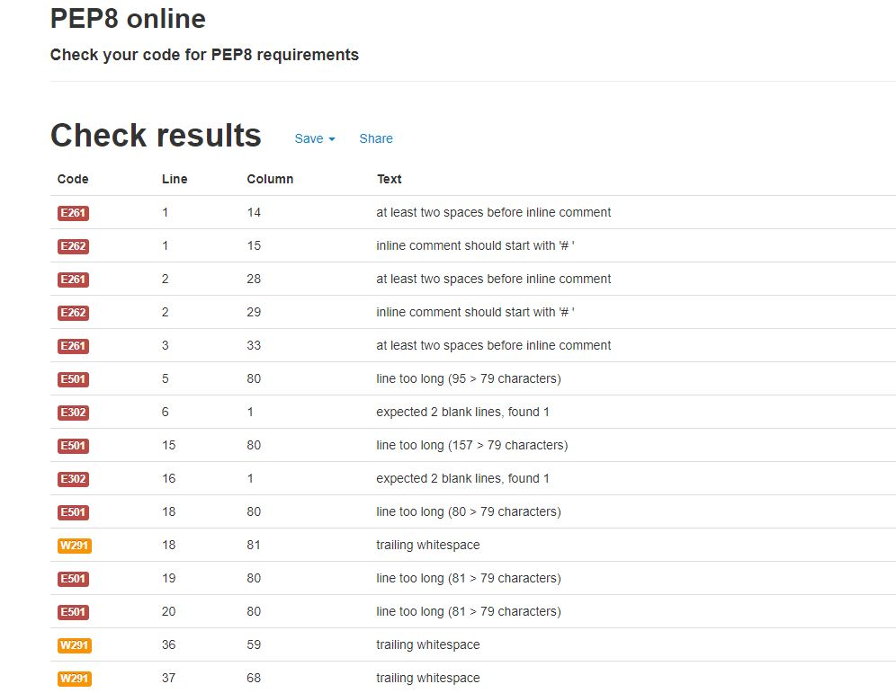
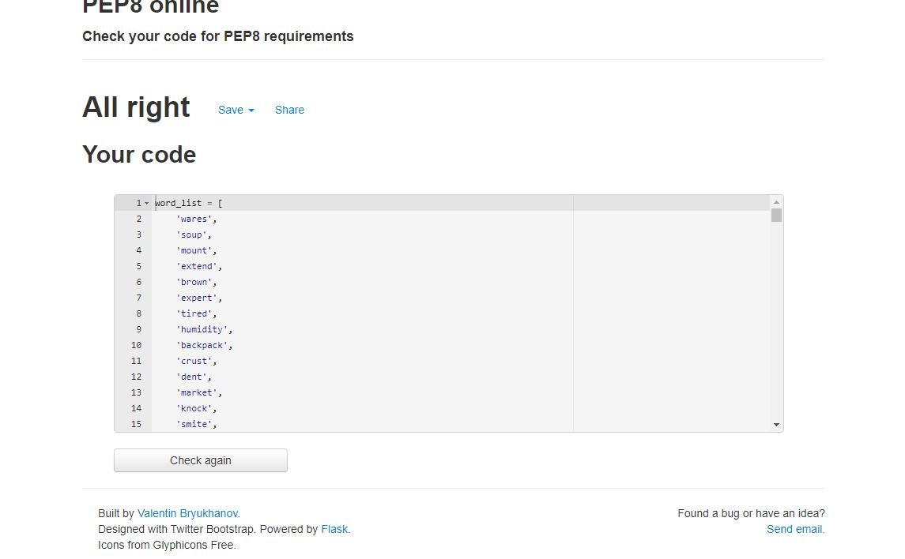
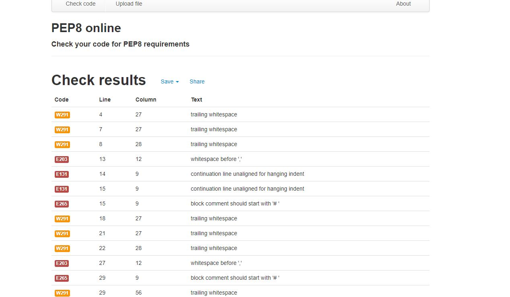

# Hangman

Hangman is a fun game to play on a console. This game lets users guess the words and letters with a funny hangman visual. Try and have fun! 

## Features

### Existing features

* Random word pulled from the list of words
* Visual display of hangman stages
* Display of how many letters there are in the target word
* Validating user input and asking the user for a new input if the previous one is invalid

### Game flow

The game starts by initiating the code using the main function. Function get_word() retrieves a random word from an imported list of words. After the word has been received, the console introduces the game to the user, displaying a gallows visual and informing the user how many letters are in the target word.

The user enters either a word or a letter. IF a user enters a word, the word is checked if all characters are letters and if the number of letters is equal to the target word. If the conditions are satisfied, the word is compared with the target word. If the condition is not satisfied, user is informed that the input is incorrect and prompted to try to input a value again. When the word meets the If statement, conditions are compared with the target word if the answer is incorrect, the number of tries is reduced by 1. If the comment if correct the progression is updated to the maximal value.

In case the input is a single character, IF statement checks if the input is a letter. If the input is not a letter, user is informed that the input is incorrect and is prompted to try again. If the character is a letter, the letter is assessed if it has been used. If the letter has already been used, the user is informed that the letter has been used and input a different answer. If the letter has not been used yet in the game session, the letter is compared with the letters in the word. If the letter is in the word, the visuals and progression are updated, otherwise the number of tries is reduced by one. 

The process keeps repeating itself till the end game conditions have not been met. In this game, there are two end-game conditions. Firs condition is that the progression has achieved its maximum, e.g., the player has guessed the word, or the number of tries has been reduced to 0. If the player fills the progression to maximum, the user is greeted with the message that the game is won. If the player used his last try, he is greeted with the full and final hangman visual and informed that the game is lost and the target word. 

After the game has ended, the user is prompted to play another game. If the user answers Y, a new game is started. If the user answers N, the game ends.

### Visuals

In this game, there are used as part of the list.  The visuals are pulled based on the number of attempts. As the attempts are reduced, a new image of the hangman is pulled and replaces the previous one on the console. Each visual is designed in a funny way to have an additional funny comment in case the game is played by a younger audience.

Besides the visual display of the hangman, the console also informs the user how many words are in the game to avoid frustration with counting empty spaces. 

### Features to implement

* add option for user to chosse list of random words base on themes like music, history, movies, pop culture, memes etc.
* update the code to support multiple word questions
* implement object oriented programing for easier future work on the code

## Testing

I have manually tested this code by doing the following:
* Passed the code through a PEP8 linter and confirmed there are no problems
* Tested code in my local terminal
* I used Python tutor to help me visualise logic in my lines of code
* I googled validation errors and warnings to better understand how to correct them

### Bugs

#### Solved bugs
* When I was writing this code, I got bugs as I was mixing the variable answer with the text term guess when writing the code

* I was also getting bugs wile building loops and calling variables out before I assined them

* During the writing and compiling loop inside the loop, I missed a line to update variable for remaining tries, which would give the user an infinite number of guesses with no chance of losing the game and no visual updates

* I had also bugs with wisuals the way they were written. At some point the visuals were distorted. I fixed the bug by adding a dot after \ symbol

Visuals before fixing:

Visuals before fixing in code:

Visuals after fixing the code:

### Bugs remaining

* No bugs remaining

### Validator Testing

* Code has been validated using PEP8
* run.py, words.py and hangman_visuals.py have been tested
* Code needed to be fix to pass the validation
* I read on https://stackoverflow.com/ more details on specific errors and how to fix them
* No errors were returned after code fixing

Initial validation of run.py:

Validation of run.py after fixing:

Validation of words.py:

Initial validation of hangman_visuals.py:

Validation of hangman_visuals.py after fixing:

## Deployment

This project was deployed using Code Institute's mock terminal for Heroku using the following steps:
* Making sure if there were requirements needed updating before deployment as per Loves-sandwiches walkthrough project
* Creating a new Heroku app
* Setting build backs to Python and NodeJS in that order
* Link the Heroku app to the repository
* Clicking deploy and enabling auto-deploy

Deploying project:

Deployed project:

## Cedits

* Code Institute for Python essential template and deployment terminal
* [Kite](https://www.youtube.com/watch?v=m4nEnsavl6w) and [Kylie Ying](https://www.youtube.com/watch?v=cJJTnI22IF8) for youtube tutorial on how to build a hangman
* [Stackoverflow](https://stackoverflow.com/) for various answer on how to build a code and explanation on errors and warning during code validation
* [Realpython](https://realpython.com/) on tips on how to document my code as well as other usefult tips for coding in Python
* [Jack](https://github.com/iamjackwachira) my mentor for guidence during this project