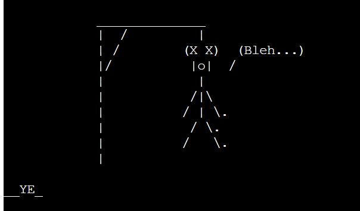
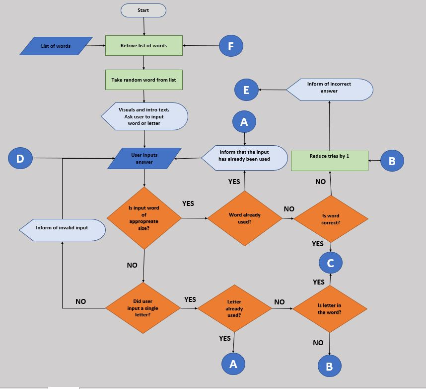

# Hangman

Hangman is a fun game to play on a console. This game lets users guess the words and letters with a funny hangman visual. Try and have fun! 

## Features

### Game flow

The game starts by initiating the code using the main function. Function get_word() retrieves a random word from an imported list of words. After the word has been received, the console introduces the game to the user, displaying a gallows visual and informing the user how many letters are in the target word.

The user enters either a word or a letter. If a user enters a word, the word is checked if all characters are letters and if the number of letters is equal to the target word. If the conditions are satisfied, the word is compared with the target word. If the condition is not satisfied, user is informed that the input is incorrect and prompted to try to input a value again. When the word that meets the If statement conditions is compared with the target word, if the answer is incorrect number of tries is reduce by 1.

### Features to implement

## Testing

## Deployment

## Cedits
